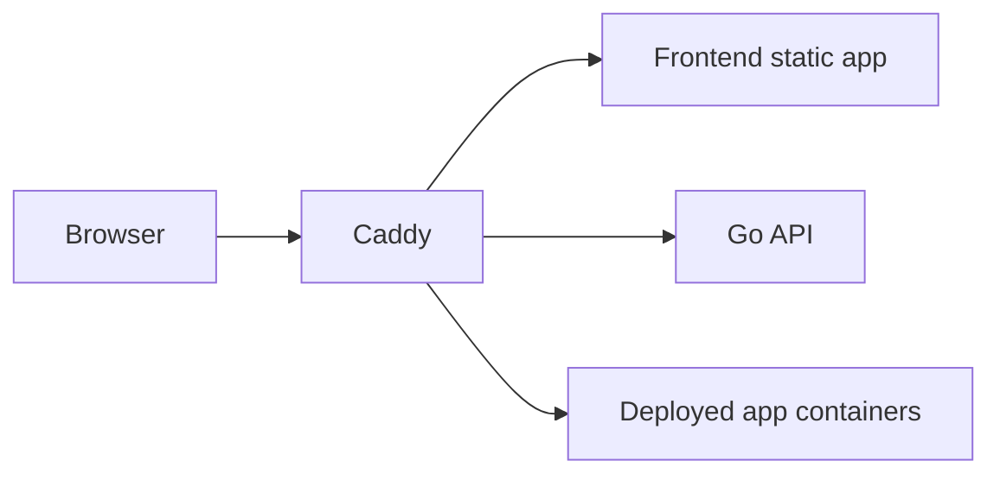
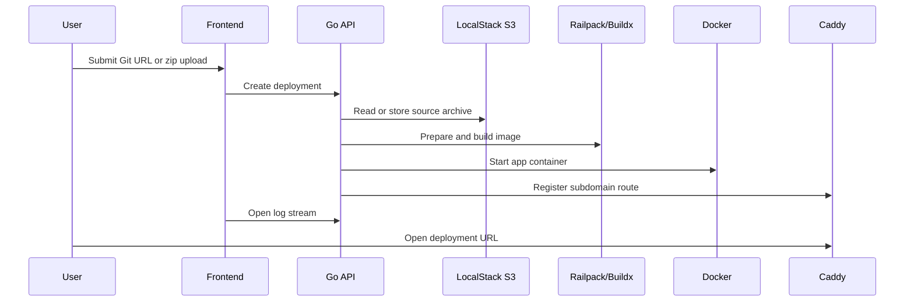

# brimble-paas

This repo constains a simple application. It is a one-page deployment pipeline for containerized apps built with Vite + TanStack on the frontend and a Gin framework Rest API, Railpack builds, Docker runtime, and Caddy ingress.

## Run

To start everything:

```bash
docker compose up --build
```

UI:

- `http://localhost`

API health:

- `http://localhost/api/health`

Deployment URLs:

- Each deployment is exposed on `http://<deployment-subdomain>.localhost`
- `*.localhost` resolves to loopback on modern systems and browsers

## What Starts

- `caddy`: single ingress, serves the built frontend and proxies `/api/*`
- `api`: Go service, runs `goose` migrations on startup, builds apps with Railpack, starts containers with Docker, and registers routes in Caddy
- `postgres`: deployment state and persisted logs
- `localstack`: S3-compatible storage for uploaded source archives
- `buildkit`: backend build engine used by Railpack

## Architecture notes

Brimble is a single-ingress local PaaS loop: the browser talks to one UI, the UI talks to one API, and the API is responsible for building, starting, and routing deployed apps.



At a high level:

- `caddy` is the single ingress. It serves the frontend, proxies `/api/*` to the Go API, and forwards deployment subdomains to running app containers.
- `api` is the control plane. It accepts deployments, stores state, runs builds, starts containers, registers Caddy routes, and streams logs back to the UI.
- `postgres` stores deployment records and persisted logs.
- `localstack` provides S3-compatible object storage for uploaded source archives.
- `buildkit` is used by Railpack during production-style builds.

Deployment flow:



The main design split is simple:

- The frontend is just the operator UI.
- The API is the orchestrator.
- Caddy is the traffic entrypoint.
- Docker is the runtime.
- Railpack + Buildx are the build path.

## Explanation link
1: https://www.loom.com/share/05ff44400f044baa8b3907df91c827ff
2: https://www.loom.com/share/c7794edfbf4a44ebb63e313cb02ce645

Both videos total 10 mins and had to be split into 2 because of Loom
